# Business-Intelligence-Solution-Design-on-Sales-Data

## Introduction

This is a business case from Business Intelligence System course. The objective of this individual project is to implement a BI project to help the target sales company better understand their sales history through some interactive visualizations and reports. 

The whole project can be summarized as these following steps.

- Project Planning & Business Requirement Definition

- Dimensional Modeling & Physical Design

- ETL Design and Development 

- BI Application Design and Development

- Final Deployment

In this project, I'll cover the first four steps, since the final deployment is usually used in a production environment and varies in different companies.

## Project Planning & Business Requirement Definition

Business Scenario and Company Background

The sales company we work for manufactures and sells products to make money.  The products are grouped into product categories and types for simplicity in stocking, marketing, and otherwise organizing them. Each product has a Price (full retail price, when sold to customers) a Wholesale Price (discounted price, when sold to resellers) and a Cost (the cost to produce the product).  The products are sold either directly to customers or to resellers who will resell them to their own customers.  These product sales happen through different channels (ways of interacting with customers and resellers) and some sales happen though physical stores, while others happen online via the company website.

The company has asked us to help them analyze their sales history and make recommendations to improve the company sales profit. We need to build an end-to-end BI system that enables us to answer all the business questions and make recommendations to improve the company sales profit. The business questions are as follows.

1. Overall sales performance.
2. Give an overall assessment of store number 10, and 21 sales.
 - How are they performing compared to target? Will they meet their 2014 target?
 - Should either store be closed? Why or why not?
 - What should be done in the next year to maximize store profits?
3. Assess product sales by day of the week at stores 10 and 21. What can we learn about sales trends?
4. Should any new stores be opened? Include all stores in your analysis if necessary. If so, where? Why or why not?

The core metircs (measures) we used in our design are as follows.

1.	Sales Amount (Quantity * Price)
2.	Sales Quantity
3.	Sales Profit (Quantity * Price) – (Quantity * Cost)
4.	Profit Margin % of individual products  (Price – Cost) / (Price)
5.	Actual to Target comparison

Please note that the price of the product changes depending on who it was sold to (resellers vs non-resellers).

The source system ERD is shown as below. [Link to Source System ERD](SourceSystem ERD.vsdx)

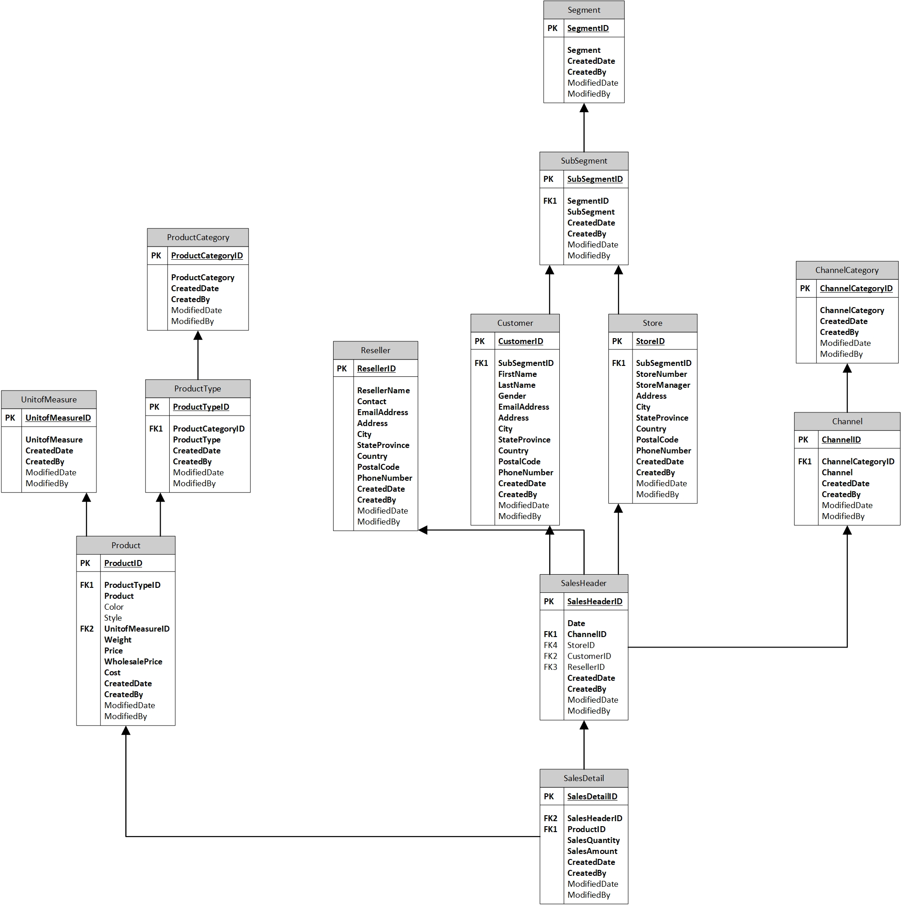

It's important to know what we are going to build for them should be able to answer the business questions based on business units requirements.

## Dimensional Modeling & Physical Design

Here I designed a dimensional model ERD as a star schema using Visio. [Link to Dimentional Modeling ERD](Final Star Schema.vsdx)

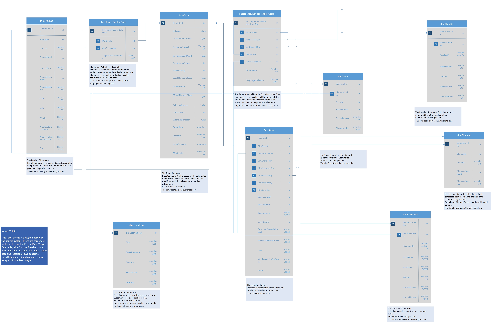

***Design note*** This Star Schema is designed based on the source system. There are three fact tables which are the ProductSalesTarget Fact table,  the Channel Reseller Store Fact table and the sales fact table. I listed date and location as two separate snowflake dimensions to make it easier for query in the later stage.

***Dimension Tables***
- The Product Dimension:
I combined product table, product category table and product type table into this dimension. The grain is each product one row.
The dimProductKey is the surrogate key. 
- The Store dimension: 
This dimension is generated from the Store table. 
Grain is one store per row.
The dimStoreKey is the surrogate key.
- The Reseller dimension: 
This dimension is generated from the Reseller table. 
Grain is one reseller per row.
The dimResellerKey is the surrogate key. 
- The Channel dimension: 
This dimension is generated from the Channel table and the Channel Category table. 
Grain is one ChannelCategory and one Channel per row.
The dimChannelKey is the surrogate key. 
- The Customer Dimension:
This dimension is generated from customer table. 
Grain is one customer per row.
The dimCustomerKey is the surrogate key. 
- The Channel dimension: 
This dimension is generated from the Channel table and the Channel Category table. 
Grain is one ChannelCategory and one Channel per row.
The dimChannelKey is the surrogate key. 

***Snow Flakes***
- The Date dimension:
I created this fact table based on the sales detail table. This table is a snowflake and would be used frequently for sales amount per day calculation.
Grain is one row per day.
The dimDateKey is the surrogate key. 
- The Location Dimension:
This dimension is a snowflake  generated from Customer, Store and Reseller tables. 
Grain is one address per row. 
I separate the address from other tables so that I can handle it easily in later usage.

***Fact Tables***
- The Target Channel Reseller Store Fact table: 
This fact table is used to collect all the target enlisted for Channel, Reseller and Stores. In the later stage, this table can help me to evaluate the target for each different dimensions altogether.
- The Sales fact table:
I created this fact table based on the sales header table and sales detail table.
Grain is one sale per row.

## ETL Design and Development 

First, I used SSIS to load source data to staging data. I used truncate to ensure that the load was able to be executed multiple times without loading duplicate data. The control flow included steps for emptying the staging tables before loading them with data again. The package also staged both target data CSV files (target sales amount for sales channels and resellers) in addition to the necessary tables from the SourceSystem database.  

The staging load control flow is shown as follows.

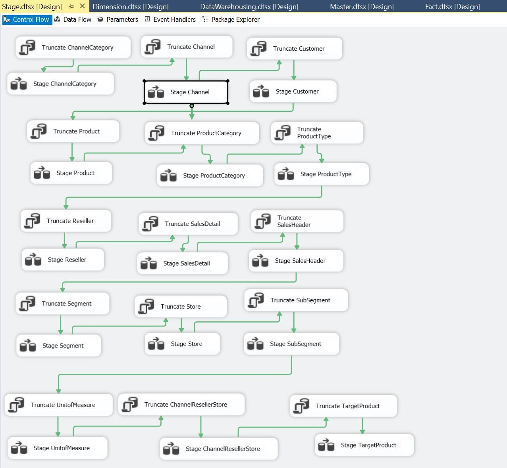

Each data flow for the SQL task in the control flow contains the movement from source data to the stage data as below.

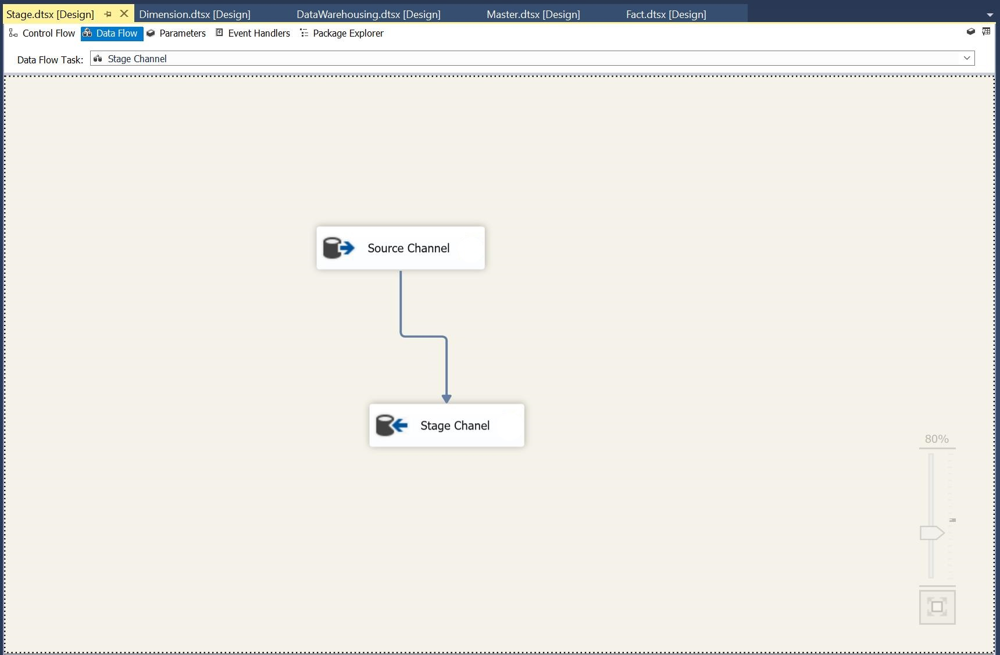

Then, I used SSIS package to load all the dimension tables from the staging tables we created before. As before, the Package was able to be executed multiple times without loading duplicate data, so it included steps for emptying the dimensions before loading them with data again. The dimension loads also included creating Unknown Members in the dimension the first time the load is executed. Besides, the dimension loads includde reseeding the Surrogate Keys when the dimension is emptied.

The control flow of the sql tasks is shown as follows.

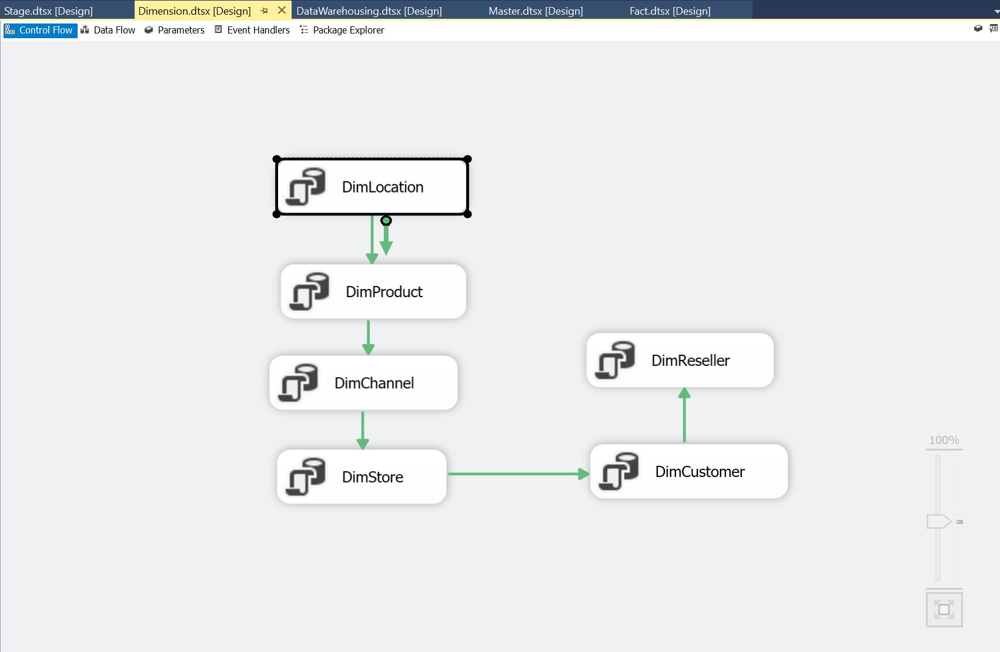

Here's the sql command in OLEDB connection for each dimension table loading task. 

-- ============
-- DimDate
-- ============
```sql

-- Create DimDate table
IF NOT EXISTS (SELECT TABLE_NAME FROM INFORMATION_SCHEMA.TABLES WHERE TABLE_SCHEMA = 'dbo' AND TABLE_NAME = 'DimDate')

CREATE TABLE dbo.DimDate
(
DimDateID INT IDENTITY(1,1) NOT NULL CONSTRAINT PK_DimDate PRIMARY KEY,
FullDate [date] NOT NULL,
DayNumberOfWeek [tinyint] NOT NULL,
DayNameOfWeek [varchar] (9) NOT NULL,
DayNumberOfMonth [tinyint] NOT NULL,
DayNumberOfYear [int] NOT NULL,
WeekdayFlag [int] NOT NULL,
WeekNumberOfYear [tinyint] NOT NULL,
[MonthName] [varchar](9) NOT NULL,
MonthNumberOfYear [tinyint] NOT NULL,
CalendarQuarter [tinyint] NOT NULL,
CalendarYear [int] NOT NULL,
CalendarSemester [tinyint] NOT NULL,
CreatedDate DATETIME NOT NULL
,CreatedBy NVARCHAR(255) NOT NULL
,ModifiedDate DATETIME NULL
,ModifiedBy NVARCHAR(255) NULL
);

GO

-- Create Stored Proceudre InsDimDateyearly to load one year of data

IF EXISTS (SELECT name FROM sys.procedures WHERE name = 'InsDimDateYearly')
BEGIN
	DROP PROCEDURE dbo.InsDimDateYearly;
END
GO

CREATE PROC [dbo].[InsDimDateYearly]
( 
	@Year INT=NULL
)
AS
SET NOCOUNT ON;

DECLARE @Date DATE, @FirstDate Date, @LastDate Date;

SELECT @Year=COALESCE(@Year,YEAR(DATEADD(d,1,MAX(DimDateID)))) FROM dbo.DimDate;

SET @FirstDate=DATEFROMPARTS(COALESCE(@Year,YEAR(GETDATE())-1), 01, 01); -- First Day of the Year
SET @LastDate=DATEFROMPARTS(COALESCE(@Year,YEAR(GETDATE())-1), 12, 31); -- Last Day of the Year

SET @Date=@FirstDate;

-- create CTE with all dates needed for load
;WITH DateCTE AS
(
SELECT @FirstDate AS StartDate -- earliest date to load in table
UNION ALL
SELECT DATEADD(day, 1, StartDate)
FROM DateCTE -- recursively select the date + 1 over and over
WHERE DATEADD(day, 1, StartDate) <= @LastDate -- last date to load in table
)

-- load date dimension table with all dates
INSERT INTO dbo.DimDate 
	(
	FullDate 
	,DayNumberOfWeek 
	,DayNameOfWeek 
	,DayNumberOfMonth 
	,DayNumberOfYear 
	,WeekdayFlag
	,WeekNumberOfYear 
	,[MonthName] 
	,MonthNumberOfYear 
	,CalendarQuarter 
	,CalendarYear 
	,CalendarSemester
	,CreatedDate
	,CreatedBy
	,ModifiedDate
	,ModifiedBy 
	)
SELECT 
	 CAST(StartDate AS DATE) AS FullDate
	,DATEPART(dw, StartDate) AS DayNumberOfWeek
	,DATENAME(dw, StartDate) AS DayNameOfWeek
	,DAY(StartDate) AS DayNumberOfMonth
	,DATEPART(dy, StartDate) AS DayNumberOfYear
	,CASE DATENAME(dw, StartDate) WHEN 'Saturday' THEN 0 WHEN 'Sunday' THEN 0 ELSE 1 END AS WeekdayFlag
	,DATEPART(wk, StartDate) AS WeekNumberOfYear
	,DATENAME(mm, StartDate) AS [MonthName]
	,MONTH(StartDate) AS MonthNumberOfYear
	,DATEPART(qq, StartDate) AS CalendarQuarter
	,YEAR(StartDate) AS CalendarYear
	,(CASE WHEN MONTH(StartDate)>=1 AND MONTH(StartDate) <=6 THEN 1 ELSE 2 END) AS CalendarSemester
	,DATEADD(dd,DATEDIFF(dd,GETDATE(), '2013-01-01'),GETDATE()) AS CreatedDate
	,'company\SQLServerServiceAccount' AS CreatedBy
	,NULL AS ModifiedDate
	,NULL AS ModifiedBy
FROM DateCTE
OPTION (MAXRECURSION 0);-- prevents infinate loop from running more than once
GO

DBCC CHECKIDENT ('dbo.DimDate', RESEED,0);
GO

-- Execute the procedure for 2013 and 2014 (those are the years you need)
EXEC InsDimDateYearly 2013

EXEC InsDimDateYearly 2014
```

-- ===============
-- dimLocation
-- ===============
```sql

-- DELETE DIMTABLES related to dimLocation
IF EXISTS (SELECT TABLE_NAME FROM INFORMATION_SCHEMA.TABLES WHERE TABLE_SCHEMA = 'dbo' AND TABLE_NAME = 'dimCustomer')
	DELETE dbo.dimCustomer;

IF EXISTS (SELECT TABLE_NAME FROM INFORMATION_SCHEMA.TABLES WHERE TABLE_SCHEMA = 'dbo' AND TABLE_NAME = 'dimStore')
	DELETE dbo.dimStore;

IF EXISTS (SELECT TABLE_NAME FROM INFORMATION_SCHEMA.TABLES WHERE TABLE_SCHEMA = 'dbo' AND TABLE_NAME = 'dimReseller')
	DELETE dbo.dimReseller;

-- DELETE DIMTABLES IF dimLocation EXISTS
IF EXISTS (SELECT TABLE_NAME FROM INFORMATION_SCHEMA.TABLES WHERE TABLE_SCHEMA = 'dbo' AND TABLE_NAME = 'dimLocation')
	DELETE dbo.dimLocation;

-- create dimLocation if not exist
IF NOT EXISTS (SELECT TABLE_NAME FROM INFORMATION_SCHEMA.TABLES WHERE TABLE_SCHEMA = 'dbo' AND TABLE_NAME = 'dimLocation')
	CREATE TABLE dbo.dimLocation
	(
	dimLocationKey INT IDENTITY(1,1) CONSTRAINT PK_dimLocation PRIMARY KEY CLUSTERED NOT NULL,
	Address NVARCHAR(255),
	City NVARCHAR(255),
	StateProvince NVARCHAR(255),
	Country NVARCHAR(255),
	PostalCode NVARCHAR(255)
	);
	GO

-- LOAD dimLocation DATA FROM STAGE
DBCC CHECKIDENT ('dbo.dimLocation', RESEED, 0);
GO

SET IDENTITY_INSERT dbo.dimLocation ON;
INSERT INTO dbo.dimLocation
(dimLocationKey, Address, City, StateProvince, Country, PostalCode)
VALUES
(-1, 'Unknown', 'Unknown', 'Unknown', 'Unknown', 'Unknown')
SET IDENTITY_INSERT dbo.dimLocation OFF;
GO

INSERT INTO dbo.dimLocation
(Address, City, StateProvince, Country, PostalCode)
SELECT c.Address, c.City, c.StateProvince, c.Country, c.PostalCode
FROM dbo.StageCustomer c
UNION
SELECT s.Address, s.City, s.StateProvince, s.Country, s.PostalCode
FROM dbo.StageStore s
UNION
SELECT r.Address, r.City, r.StateProvince, r.Country, r.PostalCode
FROM dbo.StageReseller r;
GO
```

-- ====================================
-- dimProduct
-- ====================================
```sql

-- DELETE DIMTABLES IF dimProduct EXISTS
IF EXISTS (SELECT TABLE_NAME FROM INFORMATION_SCHEMA.TABLES WHERE TABLE_SCHEMA = 'dbo' AND TABLE_NAME = 'dimProduct')
	DELETE dbo.dimProduct;

-- create dimProduct if not exists
IF NOT EXISTS (SELECT TABLE_NAME FROM INFORMATION_SCHEMA.TABLES WHERE TABLE_SCHEMA = 'dbo' AND TABLE_NAME = 'dimProduct')
	CREATE TABLE dbo.dimProduct
	(
	dimProductKey INT IDENTITY (1,1) CONSTRAINT PK_dimProduct PRIMARY KEY CLUSTERED NOT NULL,
	ProductID INT,
	Product NVARCHAR(50),
	ProductTypeID INT,
	ProductType NVARCHAR(50),
	ProductCategoryID INT,
	ProductCategory NVARCHAR(50),
	Color NVARCHAR(50),
	Style NVARCHAR(50),
	Weight NUMERIC(18,2),
	Price NUMERIC(18,2),
	WholesalePrice NUMERIC(18,2),
	Cost NUMERIC(18,2),
	);
	GO

-- LOAD dimProduct DATA FROM STAGE
DBCC CHECKIDENT ('dbo.dimProduct', RESEED,0);
GO

SET IDENTITY_INSERT dbo.dimProduct ON;
INSERT INTO dbo.dimProduct
(dimProductKey, ProductID, Product, ProductTypeID, ProductType, ProductCategoryID, ProductCategory, 
Color, Style, Weight, Price, WholesalePrice, Cost)
VALUES
(-1, 0, 'Unknown', 0, 'Unknown', 0, 'Unknown', 'Unknown', 'Unknown', 0, 0, 0, 0);
SET IDENTITY_INSERT dbo.dimProduct OFF;
GO

INSERT INTO dbo.dimProduct
(ProductID, Product, ProductTypeID, ProductType, ProductCategoryID, ProductCategory, 
Color, Style, Weight, Price, WholesalePrice, Cost)
SELECT p.ProductID, p.Product, p.ProductTypeID, pt.ProductType, pc.ProductCategoryID, pc.ProductCategory, 
		p.Color, p.Style, p.Weight, p.Price, p.WholesalePrice, p.Cost
FROM dbo.StageProduct p
INNER JOIN dbo.StageProductType pt
ON p.ProductTypeID = pt.ProductTypeID
INNER JOIN dbo.StageProductCategory pc
ON pt.ProductCategoryID = pc.ProductCategoryID;
GO
```

-- ====================================
-- dimChannel
-- ====================================
```sql
-- DELETE DIMTABLES IF dimChannel EXISTS
IF EXISTS (SELECT TABLE_NAME FROM INFORMATION_SCHEMA.TABLES WHERE TABLE_SCHEMA = 'dbo' AND TABLE_NAME = 'dimChannel')
	DELETE dbo.dimChannel;

-- create if dimChannel not exists
IF NOT EXISTS (SELECT TABLE_NAME FROM INFORMATION_SCHEMA.TABLES WHERE TABLE_SCHEMA = 'dbo' AND TABLE_NAME = 'dimChannel')
	CREATE TABLE dbo.dimChannel
	(
	dimChannelKey INT IDENTITY(1,1) CONSTRAINT PK_dimChannel PRIMARY KEY CLUSTERED NOT NULL,
	ChannelID INT,
	Channel NVARCHAR(50),
	ChannelCategoryID INT,
	ChannelCategory NVARCHAR(50),
	);
GO

-- LOAD dimChannel DATA FROM STAGE
DBCC CHECKIDENT ('dbo.dimChannel', RESEED, 0);
GO

SET IDENTITY_INSERT dbo.dimChannel ON;
INSERT INTO dbo.dimChannel
(dimChannelKey, ChannelCategoryID, ChannelCategory, ChannelID, Channel)
VALUES
(-1, 0, 'Unknown', 0, 'Unknown');
SET IDENTITY_INSERT dbo.dimChannel OFF;
GO

INSERT INTO dbo.dimChannel
(ChannelCategoryID, ChannelCategory, ChannelID, Channel)
SELECT c.ChannelCategoryID, cc.ChannelCategory, c.ChannelID, c.Channel
FROM dbo.StageChannelCategory cc
INNER JOIN dbo.StageChannel c
ON cc.ChannelCategoryID = c.ChannelCategoryID;
GO
```

-- ====================================
-- dimStore 
-- ====================================
```sql

-- DELETE DIMTABLES IF dimStore EXISTS
IF EXISTS (SELECT TABLE_NAME FROM INFORMATION_SCHEMA.TABLES WHERE TABLE_SCHEMA = 'dbo' AND TABLE_NAME = 'dimStore')
	DELETE dbo.dimStore;

-- create if dimStore not exist
IF NOT EXISTS (SELECT TABLE_NAME FROM INFORMATION_SCHEMA.TABLES WHERE TABLE_SCHEMA = 'dbo' AND TABLE_NAME = 'dimStore')
	CREATE TABLE dbo.dimStore
	(
	dimStoreKey INT IDENTITY (1,1) CONSTRAINT PK_dimStore PRIMARY KEY CLUSTERED NOT NULL,
	dimLocationKey INT NOT NULL CONSTRAINT FK_dimStore_dimLocation_dimLocationKey FOREIGN KEY REFERENCES dbo.dimLocation (dimLocationKey),
	StoreID INT,
	StoreNumber INT,
	StoreManager NVARCHAR(255),
	PhoneNumber NVARCHAR(20),
	);
GO

-- LOAD dimStore DATA FROM STAGE
DBCC CHECKIDENT ('dbo.dimStore', RESEED, 0);
GO

SET IDENTITY_INSERT dbo.dimStore ON;
INSERT INTO dbo.dimStore
(dimStoreKey, dimLocationKey, StoreID, StoreNumber, StoreManager, PhoneNumber)
VALUES
(-1, -1, 0, 0, 'Unknown', 'Unknown');
SET IDENTITY_INSERT dbo.dimStore OFF;
GO

INSERT INTO dbo.dimStore
(dimLocationKey, StoreID, StoreNumber, StoreManager, PhoneNumber)
SELECT dl.dimLocationKey, s.StoreID, s.StoreNumber, s.StoreManager, s.PhoneNumber
FROM dbo.StageStore s
JOIN dimLocation dl
ON
s.Address = dl.Address 
AND s.City = dl.City 
AND s.StateProvince = dl.StateProvince 
AND s.Country = dl.Country 
AND s.PostalCode = dl.PostalCode;
GO
```

-- ====================================
-- dimReseller
-- ====================================
```sql

-- DELETE DIMTABLES IF dimReseller EXISTS
IF EXISTS (SELECT TABLE_NAME FROM INFORMATION_SCHEMA.TABLES WHERE TABLE_SCHEMA = 'dbo' AND TABLE_NAME = 'dimReseller')
	DELETE dbo.dimReseller;

-- create if dimReseller not exist
IF NOT EXISTS (SELECT TABLE_NAME FROM INFORMATION_SCHEMA.TABLES WHERE TABLE_SCHEMA = 'dbo' AND TABLE_NAME = 'dimReseller')
	CREATE TABLE dbo.dimReseller
	(
	dimResellerKey INT IDENTITY (1,1) CONSTRAINT PK_dimReseller PRIMARY KEY CLUSTERED NOT NULL,
	dimLocationKey INT NOT NULL CONSTRAINT FK_dimReseller_dimLocation_dimLocationKey FOREIGN KEY REFERENCES dbo.dimLocation (dimLocationKey),
	ReSellerID UNIQUEIDENTIFIER,
	ResellerName NVARCHAR(255),
	Contact NVARCHAR(255),
	EmailAddress NVARCHAR(255),
	PhoneNumber NVARCHAR(20),
	);
	GO

-- LOAD dimReseller DATA FROM STAGE
DBCC CHECKIDENT ('dbo.dimReseller', RESEED, 0);
GO

SET IDENTITY_INSERT dbo.dimReseller ON;
INSERT INTO dbo.dimReseller
(dimResellerKey, dimLocationKey, ResellerID, ResellerName, Contact, EmailAddress, PhoneNumber)
VALUES
(-1, -1, '00000000-0000-0000-0000-000000000000', 'Unknown', 'Unknown', 'Unknown', 'Unknown');
SET IDENTITY_INSERT dbo.dimReseller OFF;
GO

INSERT INTO dbo.dimReseller
(dimLocationKey, ResellerID, ResellerName, Contact, EmailAddress, PhoneNumber)
SELECT dl.dimLocationKey, r.ResellerID, r.ResellerName, r.Contact, r.EmailAddress, r.PhoneNumber
FROM dbo.StageReseller r
JOIN dimLocation dl
ON
r.Address = dl.Address 
AND r.City = dl.City 
AND r.StateProvince = dl.StateProvince 
AND r.Country = dl.Country 
AND r.PostalCode = dl.PostalCode;
GO
```

-- ====================================
-- dimCustomer
-- ====================================
```sql
-- DELETE DIMTABLES IF dimCustomer EXISTS
IF EXISTS (SELECT TABLE_NAME FROM INFORMATION_SCHEMA.TABLES WHERE TABLE_SCHEMA = 'dbo' AND TABLE_NAME = 'dimCustomer')
	DELETE dbo.dimCustomer;

-- create dimCustomer if not exists
IF NOT EXISTS (SELECT TABLE_NAME FROM INFORMATION_SCHEMA.TABLES WHERE TABLE_SCHEMA = 'dbo' AND TABLE_NAME = 'dimCustomer')
	CREATE TABLE dbo.dimCustomer
	(
	dimCustomerKey INT IDENTITY(1,1) CONSTRAINT PK_dimCustomer PRIMARY KEY CLUSTERED NOT NULL,
	dimLocationKey INT NOT NULL CONSTRAINT FK_dimCustomer_dimLocation_dimLocationKey FOREIGN KEY REFERENCES dbo.dimLocation (dimLocationKey),
	CustomerID UNIQUEIDENTIFIER,
	FirstName NVARCHAR(255),
	LastName NVARCHAR(255),
	Gender NVARCHAR(255),
	EmailAddress NVARCHAR(255),
	PhoneNumber NVARCHAR(20),
	);
GO

-- LOAD dimCustomer DATA FROM STAGE
DBCC CHECKIDENT ('dbo.dimCustomer', RESEED, 0);
GO

SET IDENTITY_INSERT dbo.dimCustomer ON;
INSERT INTO dbo.dimCustomer
(dimCustomerKey, dimLocationKey, CustomerID, FirstName, LastName, Gender, EmailAddress, PhoneNumber)
VALUES
(-1, -1, '00000000-0000-0000-0000-000000000000', 'Unknown', 'Unknown', 'Unknown', 'Unknown', 'Unknown');
SET IDENTITY_INSERT dbo.dimCustomer OFF;
GO

INSERT INTO dbo.dimCustomer
(dimLocationKey, CustomerID, FirstName, LastName, Gender, EmailAddress, PhoneNumber)
SELECT dl.dimLocationKey, c.CustomerID, c.FirstName, c.LastName, c.Gender, c.EmailAddress, c.PhoneNumber
FROM dbo.StageCustomer c
JOIN dimLocation dl
ON
c.Address = dl.Address 
AND c.City = dl.City 
AND c.StateProvince = dl.StateProvince 
AND c.Country = dl.Country 
AND c.PostalCode = dl.PostalCode;
GO
```

Next, let's load fact tables into our data warehouse. As before, the sql commands enables the package to executed multiple times without loading duplicate data. Besides, based on the requirement, the fact loads included loads for all of the supplied target data (Reseller, Channel, Store, Product) and stored them at a 'daily' level of detail.

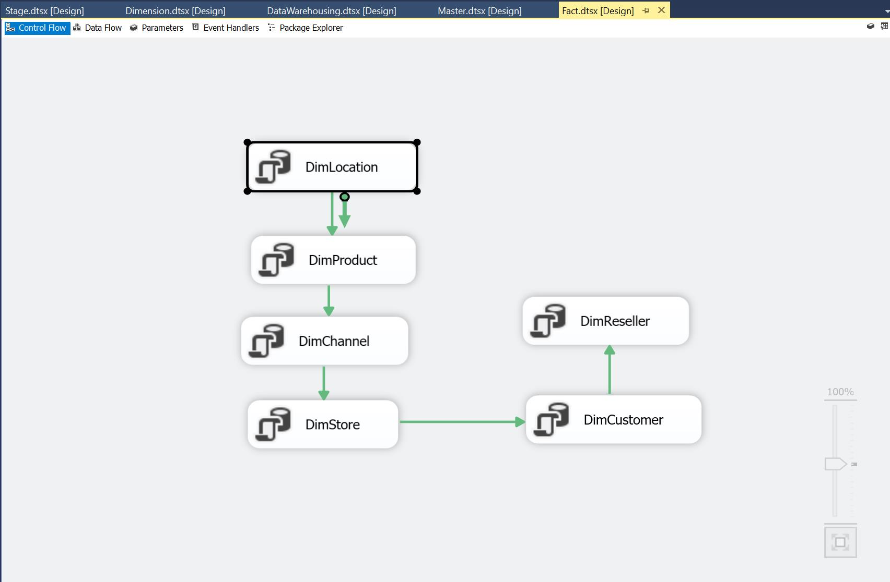

Here's the sql command in OLEDB connection for each fact table loading task. 

--=====================================================================
--CREATE AND LOAD FactSales
--=====================================================================
```sql
-- DELETE IF FactSales EXISTS
IF EXISTS (SELECT TABLE_NAME FROM INFORMATION_SCHEMA.TABLES WHERE TABLE_SCHEMA = 'dbo' AND TABLE_NAME = 'FactSales')
	DELETE dbo.FactSales

-- create FactSales if not exist
IF NOT EXISTS (SELECT TABLE_NAME FROM INFORMATION_SCHEMA.TABLES WHERE TABLE_SCHEMA = 'dbo' AND TABLE_NAME = 'FactSales')
	CREATE TABLE dbo.FactSales
	(
	FactSalesKey INT IDENTITY(1,1) CONSTRAINT PK_FactSalesKey PRIMARY KEY CLUSTERED NOT NULL,
	DimDateID INT NOT NULL CONSTRAINT FK_FactSales_DimDate_DimDateID FOREIGN KEY REFERENCES dbo.DimDate (DimDateID),
	dimLocationKey INT NOT NULL CONSTRAINT FK_FactSales_dimLocation_dimLocationKey FOREIGN KEY REFERENCES dbo.dimLocation (dimLocationKey),
	dimChannelKey INT NOT NULL CONSTRAINT FK_FactSales_dimChannel_dimChannelKey FOREIGN KEY REFERENCES dbo.dimChannel (dimChannelKey),
	dimCustomerKey INT NOT NULL CONSTRAINT FK_FactSales_dimCustomer_dimCustomerKey FOREIGN KEY REFERENCES dbo.dimCustomer (dimCustomerKey),
	dimResellerKey INT NOT NULL CONSTRAINT FK_FactSales_dimReseller_dimResellerKey FOREIGN KEY REFERENCES dbo.dimReseller (dimResellerKey),
	dimStoreKey INT NOT NULL CONSTRAINT FK_FactSales_dimStore_dimStoreKey FOREIGN KEY REFERENCES dbo.dimStore (dimStoreKey),
	dimProductKey INT NOT NULL CONSTRAINT FK_FactSales_dimProduct_dimProductKey FOREIGN KEY REFERENCES dbo.dimProduct (dimProductKey),
	SalesHeaderID INT,
	SalesDetailID INT,
	SalesQuantity INT,
	SalesAmount NUMERIC(18,4),
	ExtendedCostCostXQuantitySold NUMERIC(18,4),
	Price NUMERIC(18,4),
	Cost NUMERIC(18,4),
	WholesalePrice NUMERIC(18,4)
	);
GO

-- LOAD FactSales DATA FROM STAGE
INSERT INTO dbo.FactSales
(DimDateID, dimLocationKey, dimChannelKey, dimCustomerKey, dimResellerKey, dimStoreKey, dimProductKey, SalesHeaderID, 
SalesDetailID, SalesQuantity, SalesAmount, ExtendedCostCostXQuantitySold, Price, Cost, WholesalePrice)

SELECT 
DD.DimDateID, 
COALESCE(ds.dimLocationKey, dcu.dimLocationKey, dr.dimLocationKey, -1) AS dimLocationKey, 
COALESCE(dc.dimChannelKey, -1) AS dimChannelKey, COALESCE(dcu.dimCustomerKey, -1) AS dimCustomerKey, 
COALESCE(dr.dimResellerKey, -1) AS dimResellerKey, COALESCE(ds.dimStoreKey, -1) AS dimStoreKey, dp.dimProductKey, 
ssh.SalesHeaderID, ssd.SalesDetailID, ssd.SalesQuantity, ssd.SalesAmount, 
dp.Cost*ssd.SalesQuantity AS ExtendedCostCostXQuantitySold, dp.Price, dp.Cost, dp.WholesalePrice
FROM dbo.StageSalesDetail ssd
LEFT JOIN StageSalesHeader ssh ON ssh.SalesHeaderID = ssd.SalesHeaderID
LEFT JOIN dimProduct dp ON ssd.ProductID = dp.ProductID 
LEFT JOIN dimCustomer dcu ON ssh.CustomerID = dcu.CustomerID
LEFT JOIN dimChannel dc ON ssh.ChannelID = dc.ChannelID
LEFT JOIN DimDate DD ON DD.FullDate = ssh.Date
LEFT JOIN dimReseller dr ON dr.ReSellerID = ssh.ResellerID
LEFT JOIN dimStore ds ON ds.StoreID = ssh.StoreID

--RESEED the identity column
DBCC CHECKIDENT ('dbo.FactSales', RESEED, 0);
GO
```
--=====================================================================
--CREATE AND LOAD FactTargetProduct
--=====================================================================
```sql
-- DELETE IF FactTargetProduct EXISTS
IF EXISTS (SELECT TABLE_NAME FROM INFORMATION_SCHEMA.TABLES WHERE TABLE_SCHEMA = 'dbo' AND TABLE_NAME = 'FactTargetProduct')
	DELETE dbo.FactTargetProduct

-- create FactTargetProduct if not exist
IF NOT EXISTS (SELECT TABLE_NAME FROM INFORMATION_SCHEMA.TABLES WHERE TABLE_SCHEMA = 'dbo' AND TABLE_NAME = 'FactTargetProduct')
	CREATE TABLE dbo.FactTargetProduct
	(
	FactTargetProductKey INT IDENTITY(1,1) CONSTRAINT PK_FactTargetProductKey PRIMARY KEY CLUSTERED NOT NULL,
	DimDateID INT NOT NULL CONSTRAINT FK_FactTargetProduct_DimDate_DimDateID FOREIGN KEY REFERENCES dbo.DimDate (DimDateID),
	dimProductKey INT NOT NULL CONSTRAINT FactTargetProduct_dimProduct_dimProductKey FOREIGN KEY REFERENCES dbo.dimProduct (dimProductKey),
	SalesQuantitybyDay DECIMAL(18,4)
	);
GO

-- LOAD FactTargetProduct DATA FROM STAGE
INSERT INTO dbo.FactTargetProduct
(
DimDateID, dimProductKey, SalesQuantitybyDay
)
SELECT DD.DimDateID, dp.dimProductKey, tp.SalesQuantityTarget/365 AS SalesQuantitybyDay
FROM dbo.StageTargetProduct tp
LEFT JOIN DimDate DD ON DD.CalendarYear = tp.Year
LEFT JOIN dimProduct dp ON tp.ProductID = dp.ProductID
WHERE DimDateID IS NOT NULL

--RESEED the identity column
DBCC CHECKIDENT ('dbo.FactTargetProduct', RESEED, 0);
GO
```
--=====================================================================
--CREATE AND LOAD FactTargetChannelResellerStore
--=====================================================================
```sql
-- DELETE IF FactTargetChannelResellerStore EXISTS
IF EXISTS (SELECT TABLE_NAME FROM INFORMATION_SCHEMA.TABLES WHERE TABLE_SCHEMA = 'dbo' AND TABLE_NAME = 'FactTargetChannelResellerStore')
	DELETE dbo.FactTargetChannelResellerStore

-- create FactTargetChannelResellerStore if not exist
IF NOT EXISTS (SELECT TABLE_NAME FROM INFORMATION_SCHEMA.TABLES WHERE TABLE_SCHEMA = 'dbo' AND TABLE_NAME = 'FactTargetChannelResellerStore')
	CREATE TABLE dbo.FactTargetChannelResellerStore
	(
	FactTargetChannelResellerStoreKey INT IDENTITY(1,1) CONSTRAINT PK_FactTargetChannelResellerStoreKey PRIMARY KEY CLUSTERED NOT NULL,
	DimDateID INT NOT NULL CONSTRAINT FK_FactTargetChannelResellerStore_DimDate_DimDateID FOREIGN KEY REFERENCES dbo.DimDate (DimDateID),
	dimLocationKey INT NOT NULL CONSTRAINT FK_FactTargetChannelResellerStore_dimLocation_dimLocationKey FOREIGN KEY REFERENCES dbo.dimLocation (dimLocationKey),
	dimChannelKey INT NOT NULL CONSTRAINT FK_FactTargetChannelResellerStore_dimChannel_dimChannelKey FOREIGN KEY REFERENCES dbo.dimChannel (dimChannelKey),
	dimStoreKey INT NOT NULL CONSTRAINT FK_FactTargetChannelResellerStore_dimStore_dimStoreKey FOREIGN KEY REFERENCES dbo.dimStore (dimStoreKey),
	dimResellerKey INT NOT NULL CONSTRAINT FK_FactTargetChannelResellerStore_dimReseller_dimResellerKey FOREIGN KEY REFERENCES dbo.dimReseller (dimResellerKey),
	TargetName VARCHAR(255),
	DailyTargetSalesAmt DECIMAL(18,4)
	);
GO

-- LOAD FactTargetChannelResellerStore DATA FROM STAGE
INSERT INTO dbo.FactTargetChannelResellerStore
(
DimDateID, dimLocationKey, dimChannelKey, dimStoreKey, dimResellerKey, TargetName, DailyTargetSalesAmt
)
SELECT 
DD.DimDateID, 
COALESCE(ds.dimLocationKey, dr.dimLocationKey, -1) AS dimLocationKey,
COALESCE(dc.dimChannelKey, -1) AS dimChannelKey, 
COALESCE(ds.dimStoreKey, -1) AS dimStoreKey,
COALESCE(dr.dimResellerKey, -1) AS dimResellerKey,
t.TargetName, 
(t.TargetSalesAmount)/365 AS DailyTargetSalesAmt
FROM StageTargetChannelResellerStore t
LEFT JOIN dbo.DimDate DD ON DD.CalendarYear = t.Year
LEFT JOIN dimChannel dc ON t.ChannelName = REPLACE(dc.Channel, 'On-line', 'Online')
LEFT JOIN dimReseller dr ON t.TargetName = REPLACE(dr.ResellerName, 'Mississipi', 'Mississippi')
LEFT JOIN dimStore ds ON t.TargetName = ('Store Number ' + CAST(ds.StoreNumber AS VARCHAR))

--RESEED the identity column
DBCC CHECKIDENT ('dbo.FactTargetChannelResellerStore', RESEED, 0);
GO
```
After the test, I wraped up the dimension and fact load into datawarehouse package as below.

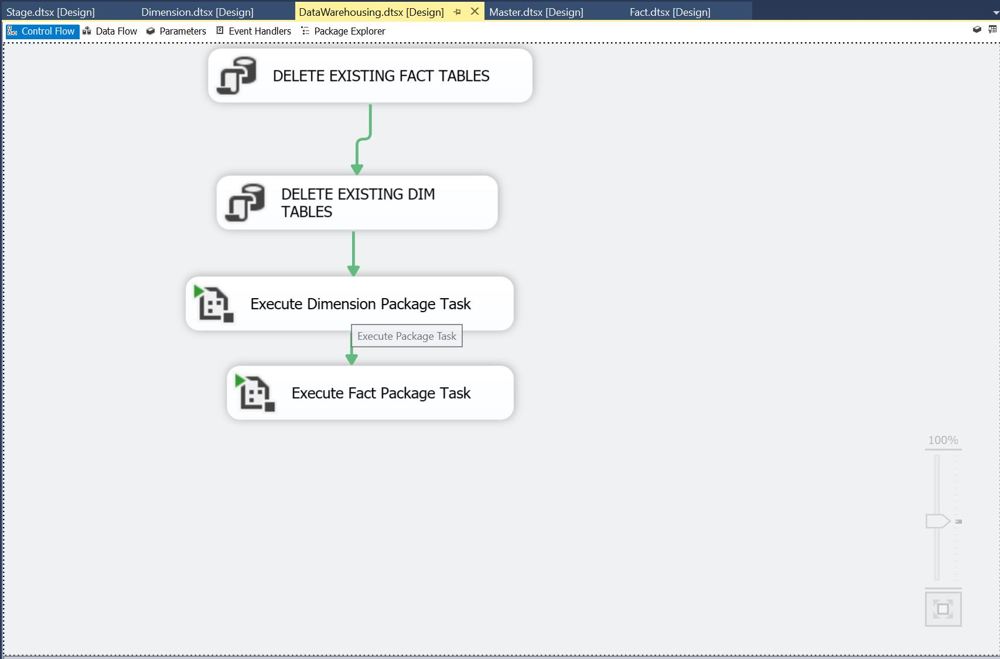

Then, the staging load package and data warehousing package were defined as task of master package, so that developers just need to execuate master pacakge itself.

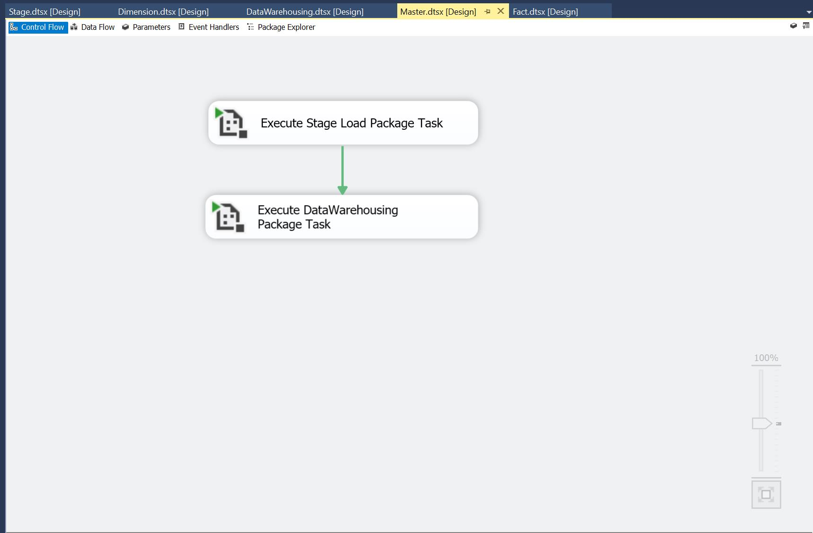

## BI Application Design and Development

For now, We've completed ETL solution, and the data warehouse is ready to be used. Let's connect Tableau to data from the data warehouse via SQL views.
The sql views are defined as follows.
```sql
CREATE VIEW [view_dimchannel] AS 
SELECT DimChannelKey, Channel, ChannelID, ChannelCategoryID, ChannelCategory
FROM DimChannel;

CREATE VIEW [view_dimcustomer] AS
SELECT DimCustomerKey, DimLocationKey, CustomerID, FirstName, LastName, Gender, EmailAddress, PhoneNumber
FROM DimCustomer;

CREATE VIEW [view_dimdate] AS
SELECT DimDateID, FullDate, DayNumberOfWeek, DayNameOfWeek, DayNumberOfMonth, DayNumberOfYear, 
		WeekdayFlag, WeekNumberOfYear, MonthName, MonthNumberOfYear, CalendarQuarter, CalendarYear,
		CalendarSemester, CreatedDate, CreatedBy, ModifiedDate, ModifiedBy
FROM DimDate;

CREATE VIEW [view_dimlocation] AS
SELECT DimLocationKey, Address, City, StateProvince, Country, PostalCode
FROM DimLocation;

CREATE VIEW [view__dimproduct] AS
SELECT DimProductKey, ProductID, Product, ProductTypeID, ProductType, ProductCategoryID, ProductCategory,
		Color, Style, Weight, PriceForStoreCustomer, WholeSalePriceForReseller, Cost
FROM dimProduct;

CREATE VIEW [view_dimreseller] AS
SELECT dimResellerKey, dimLocationKey, ReSellerID, ResellerName, Contact, EmailAddress, PhoneNumber
FROM DimReseller;

CREATE VIEW [view_dimstore] AS
SELECT dimStoreKey, dimLocationKey, StoreID, StoreNumber, StoreManager, PhoneNumber
FROM DimStore;

CREATE VIEW [view_factsales] AS
SELECT FactSalesKey, DimDateID, DimLocationKey, DimChannelKey, DimCustomerKey, DimResellerKey, DimStoreKey,
		DimProductKey, SalesHeaderID, SalesDetailID, SalesQuantity, SalesAmount, ExtendedCostoftheProduct,
		PriceForStoreCustomer, Cost, WholesalePriceForReseller, Profit
FROM FactSales;

CREATE VIEW [view_facttargetchannelresellerstore] AS
SELECT FactTargetChannelResellerStoreKey, DimDateID, DimLocationKey, DimChannelKey, DimStoreKey, DimResellerKey,
		TargetName, DailyTargetSalesAmt
FROM FactTargetChannelResellerStore;

CREATE VIEW [view_facttargetproduct] AS
SELECT FactTargetProductKey, DimDateID, DimProductKey, TargetSalesQuantitybyDay
FROM FactTargetProductSale;
```
The Tableau dashboard I made are as follows.

### Dashboard 1: Overall Sales Performance

Here we built a dashboard as follows. This dashboard contains five worksheets covering general performance on product profitability, sales quantity, sales amount, profit by month, sales quantity by month etc.

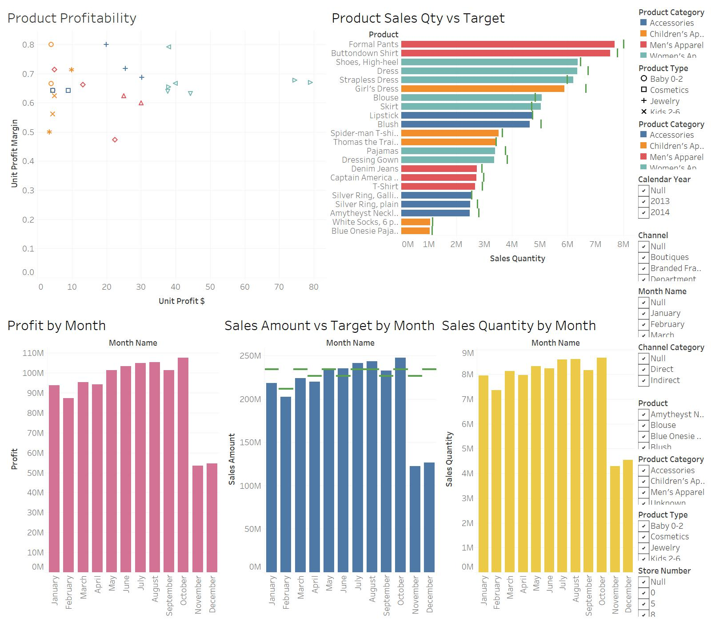

**Product Profitability**

In this worksheet, different colors representing product categories such as accessories and children's apparels, and different shapes shows product types under these categories. The y-axis is the unit profit margin, which is calculated as (Price – Cost ) / Price. The x-aixs represents the unit price, which is equal to Price - Cost.

***Design Note*** This graphic was built from the Product dimension and is used to show the profit of a single unit of a product, rather than the total profit of what was sold.

We know that the profit margin is an indication of the financial success and viability of a particular product or service. The higher the percentage, the more the company retains on each dollar of sales to service its other costs and obligations. It is often used by businesses that are looking for ways to boost their revenue, want to evaluate a product or service or simply want to take an inventory of what they’re spending versus what they’re making. In this graph, we may find that most of the current product types have a gross profit margin larger than 0.5, but Denim Jeans and Spider man T-shirt both have a relatively low profit margin. We may use that kind of graph to conduct product margin analysis to figure out the best solution. For example, if the overall sales are steady, but one product’s sales have seen a decline in recent months. After figuring out the profit margin for that particular produce line, the company might decide that it’s within its best interest to discontinue the product.

**Product Sales Qty vs. Target**

***Design Note*** This graphic was built using the Sales Fact table and the Target Fact table and represented the total sales of all product sold compared to the target for the month.

In this worksheet, we compared actual sales quantity and the target quantity, then we sorted the products in order of highest sales at the top. The green lines represent target sales quantity. As before, different colors representing product categories, so that we may identify which product sales quantity doesn't meet the target sales quantity in which product category. For example, we may find that most of the product sales quantity doesn't meet the target quantity, but they are very close to the target quantity, instead of Girl's dress. Next, analysts could dig into Girl's dress sales performance among diffrent sales channels, locations and days of week to figure out the reason.

**Profit by Month**

***Design Note*** This graphic was built using the Sales Fact table and represented the total profit of all products sold.  

The overall profit by month is steady instead of November and December, which is due to the original data lacks these two months in 2014. We may also find a trend that the sales increases a little bit in Summer and Autumn, while may hit the trough in January and February. It may happens because most discounts happened in November and consumers tend to purchase a lot in these months, and don't need much more in the following month, which is February.

**Sales Amount vs. Target by Month**

***Design Note*** This graphic was built using the Sales Fact table and the Target Fact table and represented the total sales amount of all product sold compared to the store sales amount target for the month.

As before, the green line represents the target amount and the blue bar represents the actual sales amount in each month. Since December, 2014 and November, 2014 were missing, we just focus on previous ten months for now. As we expected, this graph also shows that the actual sales amount seems a little worse in Winter, compared to in Summer. The gap between the actual amount and target amount is not big except January. The analyst could gather more data to see if the target sales amount in January we set is reasonable or not. For example, if in the past five years, the performance in January is as good as the other months, which indicates the target sales in 2013/2014 January is reasonable, we need to figure out if there's unexpected things happened in 2013 and 2014.

According to this graph, store 10 would meet 2014 target, but store 21 might not meet 2014 target. The company could consider to close store 21 if its performance continue to be worse than the other stores.

**Sales Qauntity by Month**

***Design Note*** This graphic was built using the Sales Fact table and represented the total sales quantity of all products sold.  

Compared with the Profit by Month graph, we may find an interesting thing in March and April. The sales quantity in March and April is close to the quantity in May to July, but the profits in March and April are relatively lower than the other months. That may because consumers tend to purchase more products which have a relatively low product profit in these two months. However, we need more evidence to correlate this situation with the product sales in these two months.

### Dashboard 2: Overall Assessment of Store Number 10, and 21 sales

Here we build a dashboard representing the sales amount vs. target amount bar graph, monthly target completion rate chart, quarterly target completion rate bar graph and best selling products.

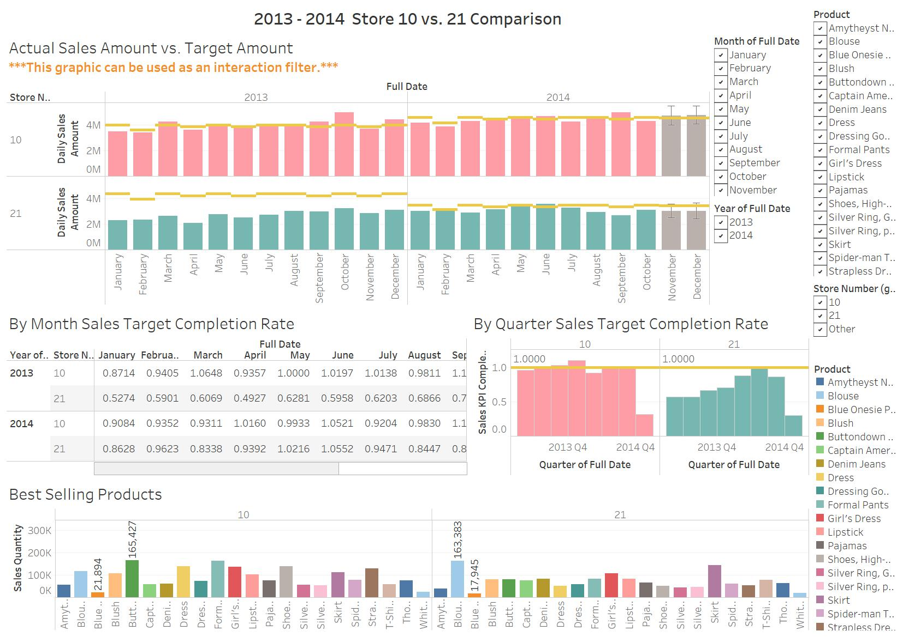

**Actual Sales Amount vs. Target Amount**

***Design Note*** This graphic was built using the Sales Fact table and the Target Fact table and represented the total sales amount of all product sold compared to the store sales amount target for the month, and keep store 10 and store 21 only. Pink bars represents store 10's actual sales amount, while green bars represents store 21's sales amount. The yellow line shows target amount for each year in store 10 and store 21. Since we lack the data in December and November 2014, we made a rough estimation using the build-in prediction functions in Tableau. The gray bars represent our sales amount predictions.

We may find notice store 21 had a worse performance in 2013 than in 2014. However, we can identify that the sales company decreased store 21's target sales amount in 2014. Actually, there isn't a big diffrence in 2013 and 2014 for store 21. The sales amount is relatively steady over these two years. When we compare these two stores from a vertical perspective, store 10's performance seems much better than store 21 in both years. In most of the months, store 10 hit the target amount in 2013, therefore, the sales company increased the target amount in 2014. Even though the targets has increased, store 10 completed the target amount successfully in 2014 as well.

**By Month Sales Target Completion Rate**

***Design Note*** This graphic was built using the Sales Fact table and the Target Fact table and represented the total sales amount of all product sold compared to the store sales amount target for the month, and keep store 10 and store 21 only. The completion rate is calculated by Sales Amount / Target Amount.

As we expected, store 10 had a better performance than store 21. The overall completion rate for store 10 dropped a little bit from 2013 to 2014, which might because we increased the target amount for store 10 in 2014. Meanwhile, the overall completion rate for store 21 increased from 63% to 76% might because we decreased the target amount for store 21.

**By Quarter Sales Target Completion Rate**

***Design Note*** This graphic was built using the Sales Fact table and the Target Fact table and represented the total sales amount of all product sold compared to the store sales amount target for the month, and keep store 10 and store 21 only.

As before, we may find store 10 had a better performance than store 21. Each bar represents the sales target completion rate by quarter. We could identify that store 10 had a relatively steady performance over quarters, but store 21 had a larger fluctuation in these quarters. The best performance quarter for store 21 is quarter 2 in 2014, whereas store 10 seemed always complete the target amount in these two years.

**Best Selling Product**

***Design Note*** This graphic was built using the Sales Fact table. Different colors represent products. We use highest sales quantity to indicate the best selling products.

In this graph, store 10's best selling product was Buttondown Shirt and the worst selling product was Blue Onesie Pajamas. In store 21, the best selling product was Blouse and the worst selling product was Blue Onesie Pajamas as well. This graph is useful for the company to make decisions on product purchase and stock amount. However, sales quantity only reflect the quantity of sales for these products. It'd be better if the analyst could combine this chart with the product profit margin graph to make decisions. To maximize store profits, the company should consider to purchase more on the best selling product and less on the worst selling product.

### Dashboard 3: Product Sales by Day of the Week at Stores 10 and 21

Here we build a dashboard representing the sales per day of the week per product, sales per product per day of the week, 12 months forecast and store geography with maps.

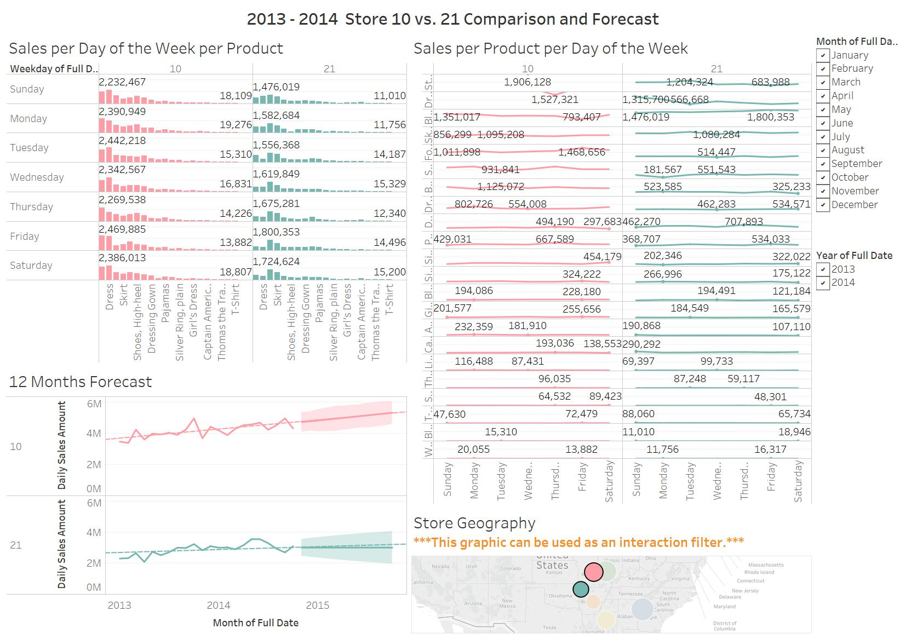

**Sales Per Day of the Week per Product**

***Design Note*** This graphic was built using the Sales Fact table. As before, pink represents store 10 and green represents store 21. Here we used sales amount in the y-axis to indicate the sales performance. 

With tooltips in Tableau, we could identify that the best selling products per day of the week in store 10 and store 21 are different. For example, Dress is the best selling product in Tuesday, Wednesday, Saturday and Sunday in store 10. The best selling product in other days of the week is Strapless Dress in store 10. For store 21, the best selling product is always blouse, no matter in which day of the week.

**Sales per Product per Day of the Week**

***Design Note*** This graphic was built using the Sales Fact table. As before, pink represents store 10 and green represents store 21. Here we used sales amount in the y-axis to indicate the sales performance. We chose line plot to show the sales trend over days of the week.

While most products sales trends are flat, dress, strapless dress and blouse are not stable in store 10. Dress and strapless dress are not stable in store 21 as well.

**12 Months Forecast**

***Design Note*** This graphic was built using the Sales Fact table. As before, pink represents store 10 and green represents store 21. Here we used sales amount in the y-axis to indicate the sales performance. We chose line plot to show the sales trend over months from 2013 to 2015.

We made 12 months forecast based on Jan 2013 to Oct 2014 sales data. The dash line represents the trend and the colored region represent the confidence interval of our forecast. From this graph, we may identify that store 10 might get better performance in the next 12 months, while store 21 may get the same or even worse performance than the current. This made us more conviced that the company might need to consider to close store 21 later.

**12 Months Forecast**

***Design Note*** This graphic was built using the Sales Fact table and the Location Dimension table. Pink represents store 10 and green represents store 21. The circle size represents the sales amount in these two stores.

We used map to show the locations of these two stores. We may find that these two stores are not too far away from each other. There're also some other stores nearby, which may indicate that if we close store 21, some customers may go to other nearby stores.


### Dashboard 4: Sales Amount with Location Info

Here we build a dashboard representing the sales amount chart, sales amount with locations, sales amount by months and store geography with maps.

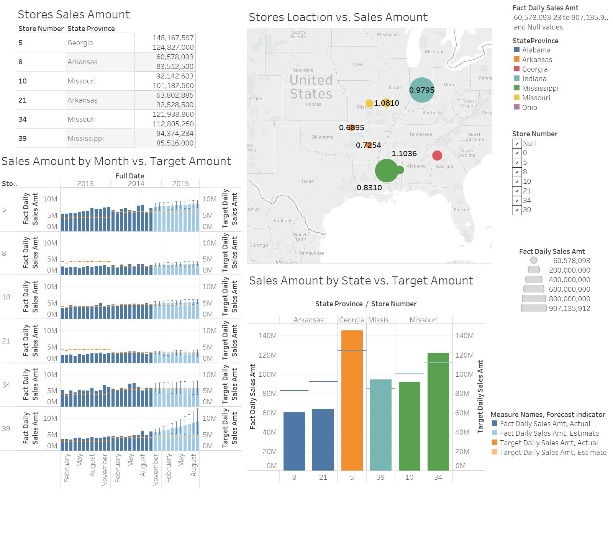

**Store Sales Amount**

***Design Note*** This graphic was built using the Sales Fact table and the Location Dimension table. The number here indicates the sales amount in different stores.

We may find that stores in Georgia and Mississippi have good performance. Store in Arkansas seems to have more space to improve. However, that also depends on other external information such as the state population number, etc.

**Stores Loaction vs. Sales Amount**

***Design Note*** This graphic was built using the Sales Fact table and the Location Dimension table. Different colors represent U.S. states, and the circle size indicates sales amount in these stores. The number marks indicates the sales amount target completion rate in each store.

Based on this graph, stores in Indiana and Mississippi both did a good job in the past two years. The completion rate in these two states are close to or more than 100%. Besides, the sales amount in these stores seems much more than the others. Stores in Missouri's and Atlanta's target completion rate seems great as well, but the overall sales amount is not as much as stores in Indiana and Mississippi. As in the Store Sales Amount chart represented, stores in Arkansas need to improve more. Both the sales amount and the target completion rate seem not good.

**Sales Amount by Month vs. Target Amount**

***Design Note*** This graphic was built using the Sales Fact table and the Location Dimension table. The x-axis shows months from 2013 to 2015, and the y-axis represents the sales amount in these months. Dark blue bars indicates the historical sales amount, whereas shallow blue bars are our pedictions for next 12 months. Yellow lines represents the target amount (historical target in 2013 and 2014, and predictive target in 2015).

Store 5 and store 39 seems to be the best in terms of historical sales amount. Both stores also indicates an increase trend in our predictive sales amount, especially store 39. The company might even need to adjust the target sales amount for store 39, since the current target amount seems easy for them to reach in 2015. Store 10's and store 34's sales amount seemed steady over years, and the target amount seemed reasonable for them as well. In terms of growth potential, store 10 seems a little better than store 34, since our prediction of store 10's sales amount shows a slightly increase trend in 2015. Neither Store 8 or store 21 reached the target amount in 2013, and the gap seemed big. After the company decreased their target sales amount in 2014, we may find that both stores got much closer to the target amount. However, in our prediction, store 21 may not reach to the target amount in 2015, and there's a prediction decrease trend in store 21 as well. Therefore, if we need to close a store, we might consider to close store 21 first.

**Sales Amount by Month vs. Target Amount**

***Design Note*** This graphic was built using the Sales Fact table and the Location Dimension table. As before, different colors represent U.S. states. The y-axis shows total sales amount in these two years. Blue line is the target sales amount.

We find that stores in Georgia and Mississippi reached the target sales amount, so we recommend Georgia and Mississippi open a new store to handle these sales. For these two stores, Mississippi near Jackson City has the priority because store 39 would have a large increase in our predictive sales. One possible choice is to open in Alabama, which is n between these two states. However, it has a higher sales tax than the other two states so the trade-off counts.
